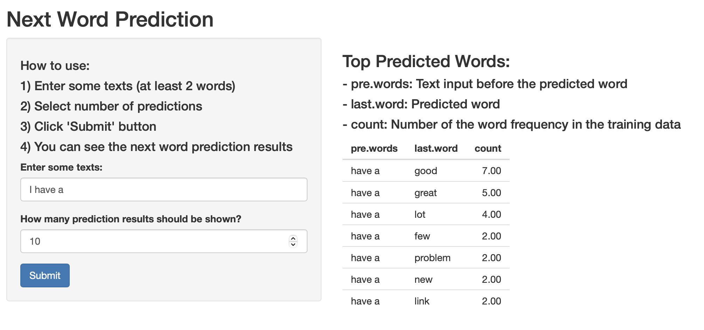

Data Science Capstone - Final Report
========================================================
author: Teppei Miyazaki
date: 12/29/2021
autosize: true

Executive Summary
========================================================

- This report is a part of the Data Science Capstone course of Coursera.
- The final goal of this course is to build an app which predicts the next word after taking a phrase as input.
- In this final report, we explain our predictive model and the next word prediction app.
- Shiny App URL: https://t-miyazaki.shinyapps.io/Word-Prediction/
- R Code URL: https://github.com/t-miyazaki/Data-Science-Capstone

Prediction Model
========================================================

- **Data**: The data for our prediction model is obtained from the Coursera site. [(link)](https://d396qusza40orc.cloudfront.net/dsscapstone/dataset/Coursera-SwiftKey.zip) This data is from a corpus called HC Corpora and includes large text files from blogs, news, and twitter. Given the large size of the data, we use only 0.1% of the data in our prediction model.
- **Model**: The prediction model is build with the following steps:
  1) Tokenize the training data set; 
  2) Build 2-grams and 3-grams of the data set; 
  3) Create algorithm that take n-1 words in the n-gram as an input and returns the most frequent last words as an output.

Predictive Performance
========================================================

- We separate the training data set into 80% train set and 20% test set.
- We built our prediction model based on this 80% training set and check how many last words in the 3-grams are correctly predicted in the 20% test set.
- The accuracy ratio was about 65% (514 correct words / 790 total words).
- For the calculation details, please see the R script "validation.R" in the R Code URL (https://github.com/t-miyazaki/Data-Science-Capstone).

Next Word Prediction App - Example
========================================================

